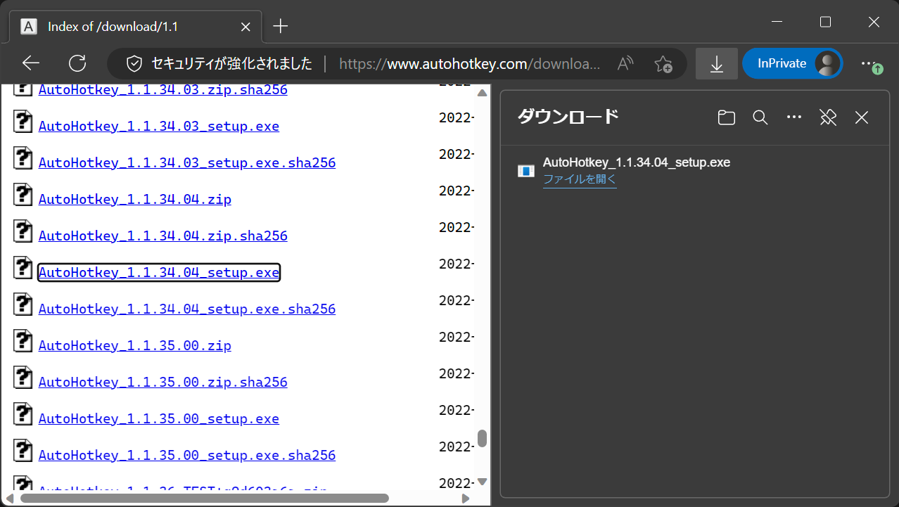
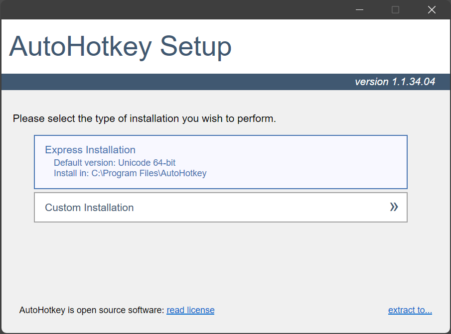
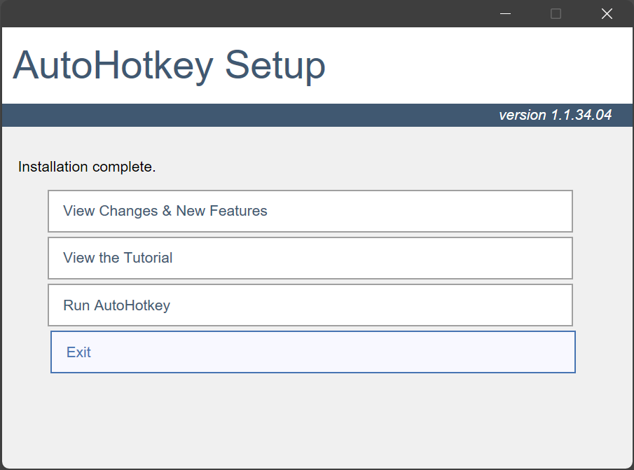
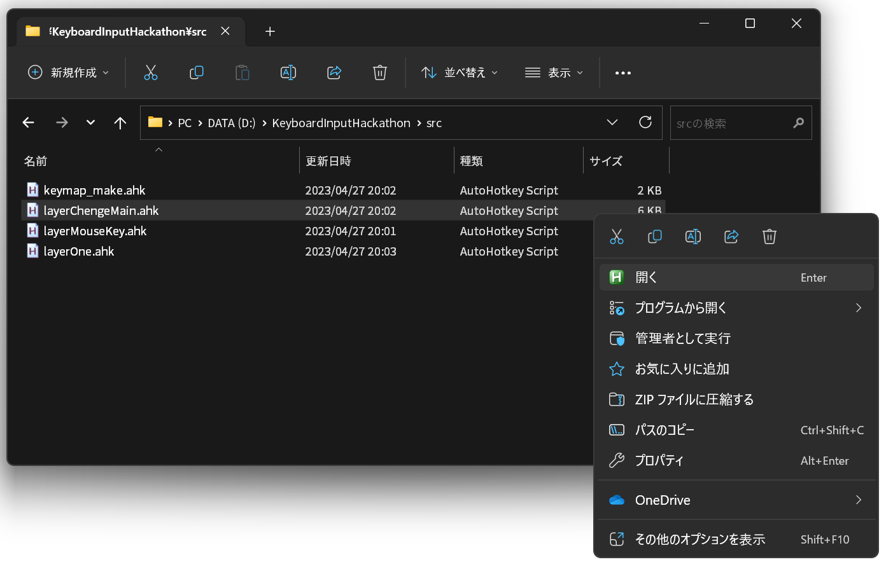

# AHK Layer Switcher
## 概要

AutoHotkeyを使用して自作キーボードのようなレイヤー機能を実現します。

具体的には以下の2つのレイヤーを追加します。

* ショートカットレイヤー
  * 様々なショートカットやユーティリティ系マクロを組み込んだ便利なレイヤーです。
* マウスカーソルレイヤー
  * マウスによる操作を代替します。

## 必要条件

* AutoHotkey 1.1.34.04

AutoHotkeynoのインストール手順を以下に示します。

1. [AutoHotkey1.1系のダウンロードページ](https://www.autohotkey.com/download/1.1)にアクセスしてください。
2. `AutoHotkey_1.1.34.04_setup.exe` をクリックしダウンロードしてください。
  * 
3. ダウンロードした実行ファイルを実行してください。
4. ユーザアカウント制御画面が表示されるので `はい` を選択してください。
5. `Express Installation` を選択してください。
  * 
6. `Exit` で終了してください。
  * 

## 使用方法

Autohotkeyで `./src/layerChengeMain.ahk` を実行してください。

  * ソースコードを直接実行する方法と、実行前にコンパイルしてから起動する方法があります。
  * 定期的に利用する場合は実行前にコンパイルしておくことをおすすめします。

### ソースコードを直接実行する方法

1. `./src/layerChengeMain.ahk` を選択し、実行してください。
  * 

### 実行前にコンパイルしてから起動する方法

---

この成果物は [Keyboard Input Hackathon 2023](https://k-i-hackathon.notion.site/Keyboard-Input-Hackathon-2023) で作成したものです。
* 紹介ページはこちら -> [AHKLayerSwitcher | Team Σ](https://k-i-hackathon.notion.site/AHKLayerSwitcher-Team-407c2b59ec5c4a21be75dffd5bc57e47)
